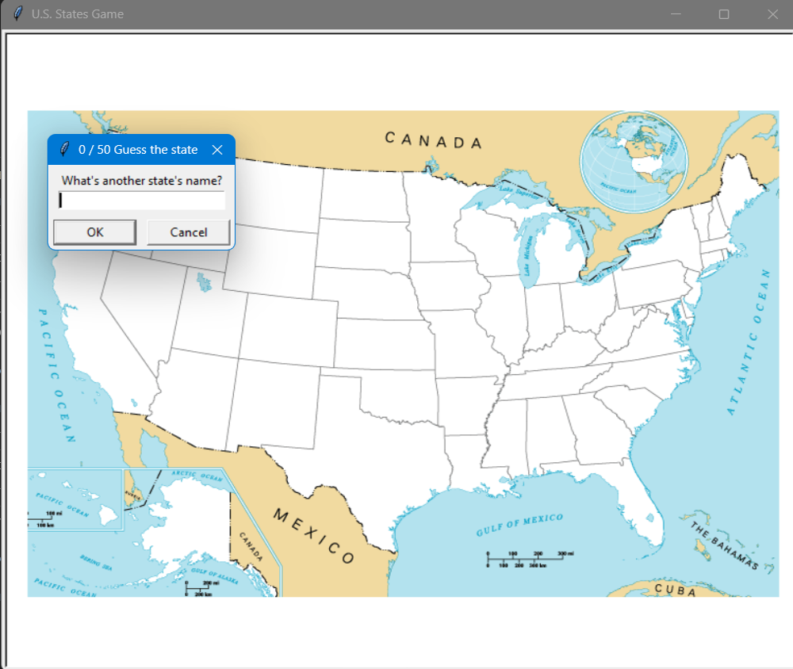
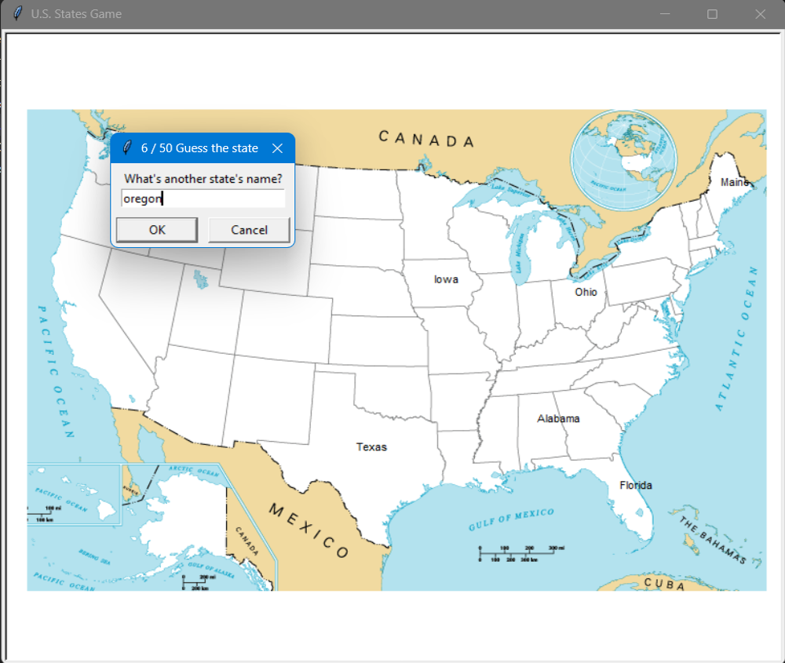
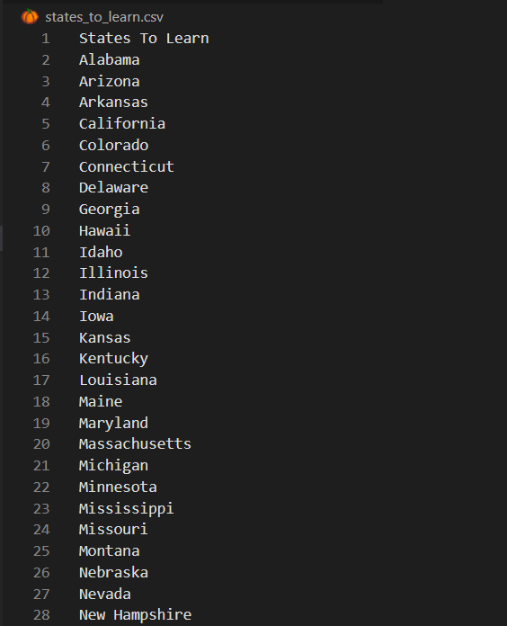

# 🇺🇸 U.S. States Game

A simple interactive game where you guess U.S. states on the map.

Built with **Python**, **turtle**, and **pandas**.

---

## 🎮 How it works

- You enter the name of a U.S. state
- If correct → it appears on the map
- Your score increases
- At the end, a file with missed states is generated

---

## 🧠 What I learned

This project was created as part of:

**100 Days of Code™: The Complete Python Pro Bootcamp**

In this project I practiced:

- working with **CSV files** using pandas  
- handling **user input**
- using **turtle graphics**
- working with **coordinates and positioning**
- basic **game loop logic**
- data filtering with pandas  

---

## 📂 Project structure

```
.
├── main.py
├── 50_states.csv
├── blank_states_img.gif
├── states_to_learn.csv
```

---

## 🖼️ Screenshots

### Game start


### Gameplay


### Result file


---

## ▶️ How to run

```bash
python main.py
```

---

## 📄 License

This project is licensed under the **Creative Commons License**.

---

## ✨ Author

GitHub: https://github.com/yukamenes